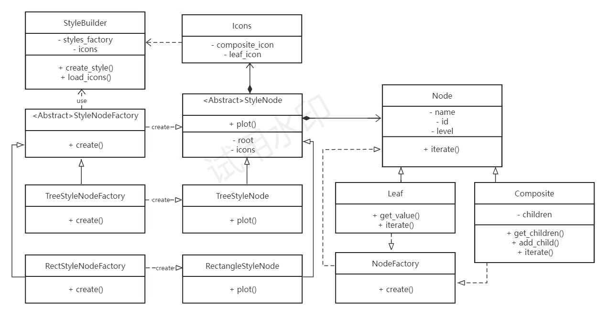
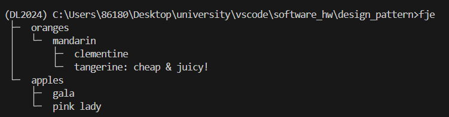
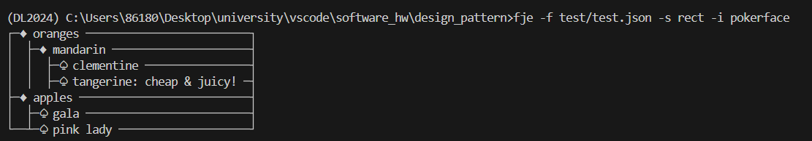
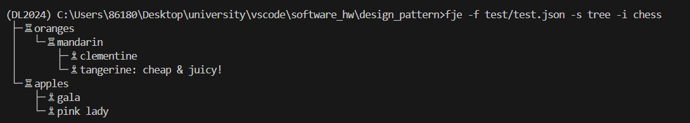
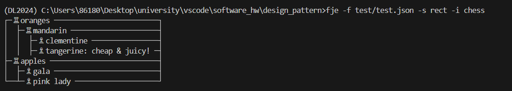
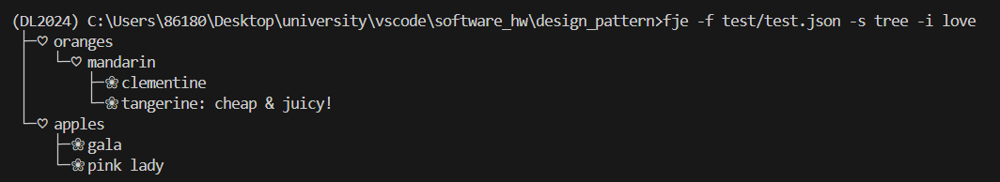

# Funny JSON Explorer

## 实验要求
Funny JSON Explorer（**FJE**），是一个JSON文件可视化的命令行界面小工具

### 需求分析
```shell
fje -f <json file> -s <style> -i <icon family>

```

```
{
    oranges: {
        'mandarin': {                            ├─ oranges
            clementine: null,                    │  └─ mandarin
            tangerine: 'cheap & juicy!'  -=>     │     ├─ clementine
        }                                        │     └─ tangerine: cheap & juicy!
    },                                           └─ apples
    apples: {                                       ├─ gala
        'gala': null,                               └─ pink lady
        'pink lady': null
    }
}
```

FJE可以快速切换**风格**（style），包括：树形（tree）、矩形（rectangle）；

```

├─ oranges                             ┌─ oranges ───────────────────────────────┐
│  └─ mandarin                         │  ├─ mandarin ───────────────────────────┤
│     ├─ clementine                    │  │  ├─ clementine ──────────────────────┤
│     └─ tangerine: cheap & juicy!     │  │  ├─ tangerine: cheap & juicy! ───────┤
└─ apples                              ├─ apples ────────────────────────────────┤
   └─ gala                             └──┴─✩gala ───────────────────────────────┘

        树形（tree）                                   矩形（rectangle）
```

也可以指定**图标族**（icon family），为中间节点或叶节点指定一套icon

```
├─♢oranges                                 
│  └─♢mandarin                             
│     ├─♤clementine                        
│     └─♤tangerine: cheap & juicy!    
└─♢apples                                  
   └─♤gala                                 

poker-face-icon-family: 中间节点icon：♢ 叶节点icon：♤                 
```

### 领域模型


## 实验内容
根据需求分析，我们可以设计如下的类图：

### 类图


### 说明：
**抽象工厂(Abstract Factory)**：`StyleNodeFactory` 是抽象工厂，定义了一个接口来创建不同风格的 `Style` 对象。`TreeStyleNodeFactory` 和 `RectStyleNodeFactory` 是具体的抽象工厂，产品的具体生产由具体抽象工厂类决定。

**工厂方法(Factory)**：而`StyleFactory` 类实际上也可以看作是工厂方法模式的实现， `create` 是工厂方法。

**建造者(Builder)**：建造者模式是一种对象构建模式。它可以将复杂对象的建造过程抽象出来(抽象类别)，使这个抽象过程的不同实现方法可以构造出不同属性的对象。
建造者模式是一步一步创建一个复杂的对象，它允许用户只通过指定复杂对象的类型和内容就可以构建它们，不需要知道内部的具体构建细节。`StyleBuilder` 是建造者，`create_style`是`Builder`模式中的结果方法(getResult)。

**组合模式(Composite)**：组合模式将对象组合成树形结构以表示"部分-整体"的层次结构，使得用户对单个对象和组合对象的使用具有一致性。组合模式的核心角色包括：`component`、`leaf`、`composite`。在上图中分别对应着`Node`、`Leaf`、`Composite`。

### 进阶 迭代器 + 策略模式
__iter__是一个特殊方法，也称为迭代器方法。当一个对象被用于迭代时，Python会调用这个方法来获取一个迭代器对象。这个迭代器对象负责生成对象中的值，可以通过for循环或next()函数逐个访问这些值。
```python
    def __iter__(self):
        return iter(self.children)
```
在类Composite中，__iter__方法被重写，以便返回一个迭代器，该迭代器能够遍历self.children列表中的所有子节点。

### 添加新的图标簇
此外，还实现了通过配置文件添加新的图标簇,只要将图标簇文件按以下格式保存在`add_icons`目录下，就可以在输入命令行时直接使用。比如我自定义了一个图标簇文件`love.json`：
```json
{
    "love": { 
        "composite": "\u2661", 
        "leaf": "\u2740"
    }
}
```

然后就能通过命令：
```shell
fje -f <json file> -s <style> -i love
```
来使用`love`图标簇。

### 打包
本项目通过`setuptools`进行打包。运行以下命令后即可打包`fje`，并通过命令行使用。
```shell
pip install -e .
```
## 实验结果
tree style - void icon



rect style - prokerface icon



tree style - chess icon



rect style - chess icon



tree style - love icon


### 链接
Github repo URL:https://github.com/Ashenial/computer-science/edit/main/software_proj/FunnyJsonExplorer
